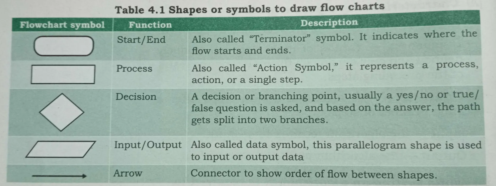
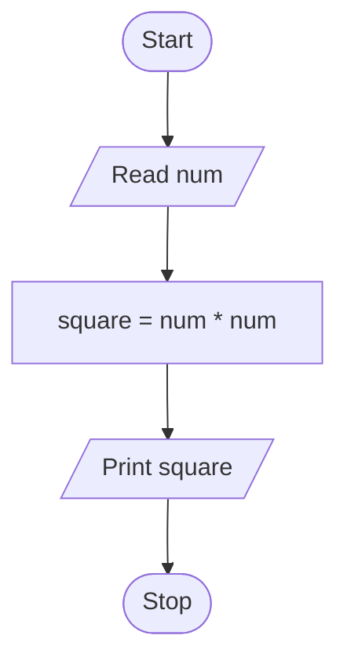
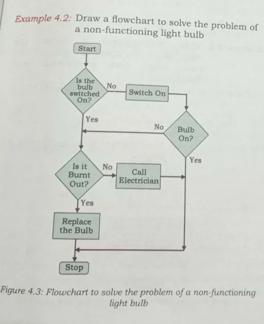
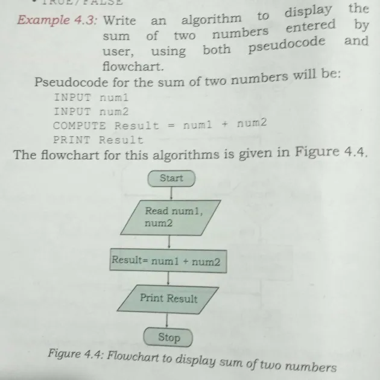
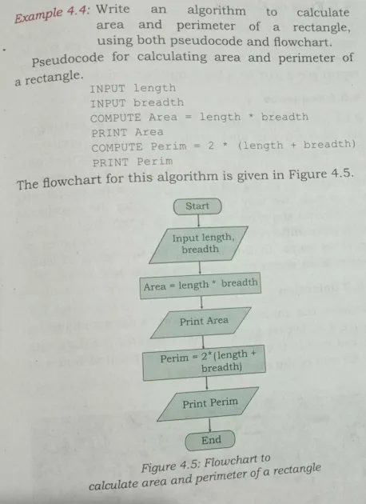

# INTRODUCTION TO PROBLEM SOLVING

- Problem Solving is the systematic process of understanding a problem, analyzing it, finding the best solution, and implementing that solution to achieve the desired result.

<br>

## STEPS FOR PROBLEM SOLVING 

### 1. Analysing the Problem
- Analysing the problem is the process of understanding the problem, identifying the inputs, outputs, and requirements, and deciding what needs to be done before writing a solution.

### 2. Developing an Algorithm
- An algorithm is a step-by-step procedure to solve a problem or perform a task in a logical and finite sequence.

### 3. Coding
- Coding is the process of writing a program in a programming language (such as Python) according to the algorithm.

### 4. Testing and Debugging
- Testing is the process of checking whether a program works correctly and gives the expected output. Debugging is the process of finding and correcting errors (bugs) in the program.

<br><br>

## ALGORITHM
- An algorithm is a step-by-step, logical, and finite set of instructions designed to solve a specific problem or perform a particular task.

### Why do we need an Algorithm?
- We need an algorithm because it provides a clear, logical, and step-by-step method to solve a problem. It helps programmers plan the solution before writing the code, making the program easier to understand, test, debug, and maintain.
- Writing an algorithm is mostly considered as a first step to programming. Once we have an algorithm to solve a problem, we can write the computer program for giving instructions to the computer in high level language. the purpose of using an algorithm is to increase is the reliabilty, accuracy and efficiency of obtaining solutions.

#### (A) Characteristics of a good algorithm
- **Precision** :- The steps are precisely stated or defined.
- **Uniqueness** :- Results of each step are uniquely defined and only depend on the input and the result of the preceding steps.
- **Finiteness** :- The algorithm always stops after a finite number of steps.
- **Input** :- The algorithm receives some input.
- **Output** :- The algorithm produces some output.

#### (B) While writing an algorithm, it is required to clearly identify the following:
- The input to be taken from the user.
- Processing or computation to be performed to get the desired result.
- The output desired by the user.

<br>

## Representation of Algorithm
- Representation of an algorithm is the method of presenting the step-by-step procedure for solving a problem in a clear, logical, and easy-to-understand form so that it can be implemented correctly.



<br><br>

### Example 1 : Write an algorithm to find the square of a number.

#### Algorithm
```
1. Start
2. Read num
3. square = num * num
4. Print square
5. Stop
```
#### Flowchart


<br>
<hr>
<br><br>

### Example 2 : Draw a flowchart to solve the problem of a non-functioning light blub



<br><hr><br><br>

## Pseudocode 
- Pseudocode is an informal and simple way of writing the steps of an algorithm using plain English and programming-like statements. It is not written in the syntax of any specific programming language, so it is easy to read, understand, and convert into a program.

- Following are some of the frequently used keywords while writing pseudocode:
    - INPUT
    - COMPUTE
    - PRINT
    - INCREMENT
    - DECREMENT
    - IF / ELSE
    - WHILE
    - TRUE / FALSE
    
<br><br>

### Benifits of Pseudocode
1. Easy to understand because it uses simple English.
2. Independent of programming language, so it can be converted into any language.
3. Helps in planning the logic before coding.
4. Makes debugging easier by finding logical errors early.
5. Improves communication among programmers and team members.
6. Saves time while writing the final program.

<br><br>

### Example 3 : Write an Algorithm to display the sum of two numbers entered by user, using both pseudocode and flowchart.



<br><br><br>

### Example 4 : Write an algorithm to calculate area and perimeter of a rectangle, using both pseudocode and flowchart .



<br><hr><br><br>

## Flow of Control
- Flow of Control is the order or sequence in which the statements or instructions of a program are executed. It determines how the program moves from one statement to another during execution.

## Types of Flow of Control
1. Sequence Flow (Sequential Flow)
- Sequence Flow is the default flow of control in which program statements are executed one after another in the order they are written, without skipping or repeating any statement.

2. Selection (Decision Making)
- Selection is a type of flow of control in which the program chooses one of the possible paths based on whether a condition is true or false.

3. Repetition (Iteration/Looping)
- Repetition is a type of flow of control in which a set of statements is executed repeatedly until a specified condition is met or for a fixed number of times.


<br><br>

## Verifying Algorithm
- Verifying an algorithm is the process of checking whether the algorithm is correct, complete, and produces the expected output for all valid inputs. It helps identify and correct logical errors before writing the actual program.

<br><br>

## Comparison of Algorithm
- Comparison of algorithms is the process of evaluating different algorithms for the same problem to select the one that is more efficient in terms of execution time, memory usage, simplicity, and correctness.

### Basis of Comparison
1. Time Efficiency – Which algorithm takes less time to execute?
2. Memory Efficiency – Which algorithm uses less memory?
3. Simplicity – Which algorithm is easier to understand and implement?
4. Accuracy – Which algorithm gives the correct result?

<br><br>

## Coding
- Coding is the process of converting an algorithm or pseudocode into a program by writing instructions in a programming language. It is the step where the solution is implemented so that the computer can execute it.

<br><br>

## Decomposition
- Decomposition is the process of breaking a complex problem into smaller, manageable sub-problems that can be solved individually and then combined to solve the original problem.
